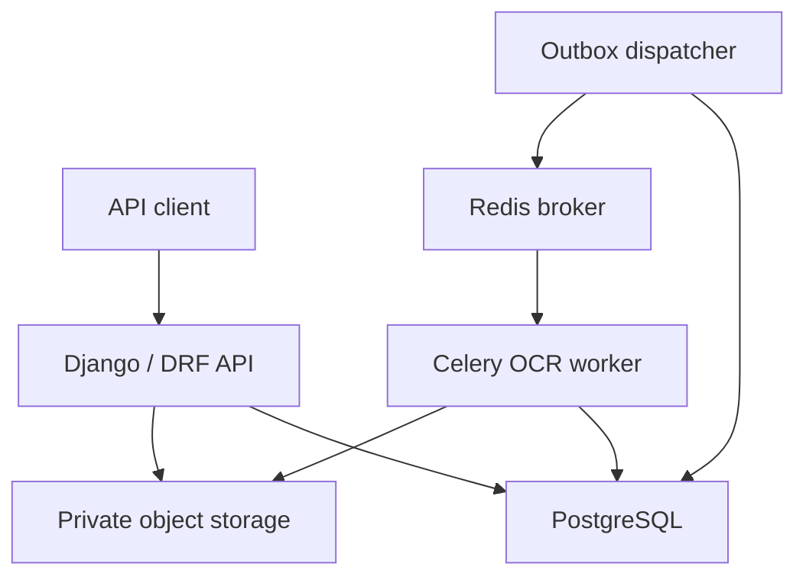
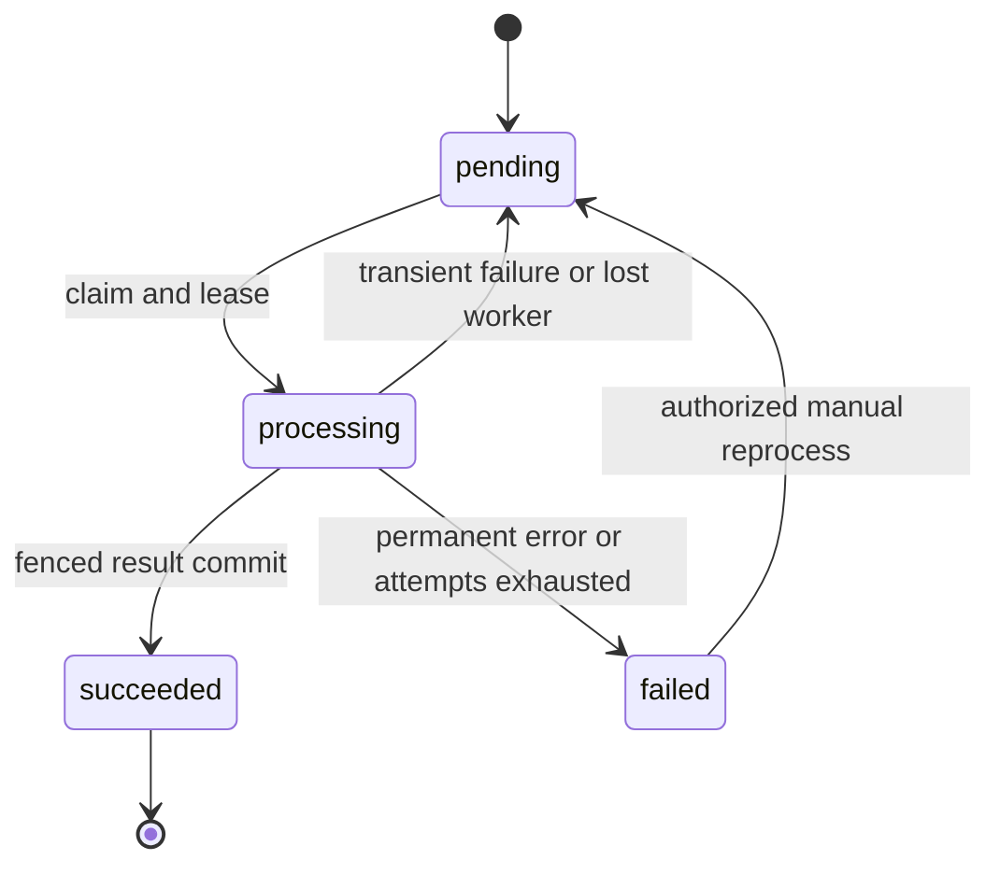

# Architecture and engineering decisions

## 1. Design intent

Mini DMS is a modular monolith with independently runnable web, OCR-worker and
outbox-dispatcher processes. The priority is predictable ownership and failure
behavior, not a large number of services. A two-user deployment must already
handle cross-user access and concurrent changes correctly; one million documents
requires measured capacity changes, not a fundamentally different definition of
ownership.

All mandatory technologies and feature areas remain in scope. Decisions made
before implementation are in [ASSUMPTIONS.md](docs/ASSUMPTIONS.md).

## 2. System topology

Redis is also a throttle cache in development. It is not the authoritative source
for document or job state. Only the API and development storage console are
bound to host loopback. The application image is non-root, read-only at runtime,
has bounded temporary storage and drops Linux capabilities. The development
database and storage services have different operational hardening needs.

## 3. Domain and consistency boundaries

| Record | Purpose | Lifetime |
| --- | --- | --- |
| `Document` | Owner, opaque object key, file identity, metadata, search and extraction state | Deleted immediately by an authorized DELETE |
| `Job` | Work intent, kind, schedule, attempts, lease and fencing token | Survives document deletion for diagnostics/recovery |
| `AuditEvent` | Actor, owner, action, document ID, request ID and safe change details | Survives document deletion |
| Django user/token records | Current role, password hash, refresh revocation | Provisioned by administrator; no public signup |

File bytes never go into the relational database. A document's UUID is not its
authorization mechanism; every query is still owner-scoped. Audit/job document IDs
are snapshots rather than cascading foreign keys so deletion does not erase its
history or cancel the necessary object-cleanup work.

Application use cases explicitly own transactions. This makes boundaries visible
in tests and avoids hidden business side effects in Django signals. Metadata and
status changes call `Document.save()` to rebuild normalized searchable text. A
PostgreSQL trigger maintains `search_vector` whenever `search_text` changes;
future code must not bypass this contract with bulk updates of metadata fields.

## 4. Upload and object-store consistency

A relational transaction cannot atomically commit an S3 write. Treating the two
as atomic would leave an orphan-file gap. Instead:

1. Validate bounded input and compute a SHA-256 fingerprint without OCR.
2. Check an optional owner-scoped idempotency key.
3. Commit an object-cleanup intent scheduled one hour in the future.
4. Write the object outside the document transaction, under a random key.
5. In one short transaction, serialize the owner's idempotency decision, create
   the document/audit/OCR intent, and mark the cleanup intent complete.

If the API dies after writing the object but before committing the document,
the cleanup intent remains due. A normal upload failure expedites cleanup.
If a concurrent identical upload won the idempotency race, the extra object is
cleaned and the winning document is returned.

The one-hour grace period exceeds the configured API/storage timeouts. It is a
documented assumption, not a distributed transaction: unusually long externally
paused processes, a storage backend renaming a colliding random key during a
crash, incomplete multipart uploads or unavailable database backups still require
operational reconciliation. Production buckets should expire abandoned multipart
uploads. Random per-document keys make accidental key collision negligible;
there is no cross-user content deduplication or information leak through it.

This is more code than a basic `FileField.save()`, but the added state addresses
a concrete failure mode and is testable. Uploading still requires request-body
transfer, hashing, storage I/O and a database commit. Only decoding and OCR are
asynchronous; saying all upload work is nonblocking would be inaccurate.

## 5. Background jobs and retries

The database job table is a transactional outbox and work ledger. It closes the
classic gap between committing a document and publishing its task. API code never
calls `delay()` inside a database transaction or relies only on `on_commit()`.

The dispatcher claims due rows with `select_for_update(skip_locked=True)`, records
a dispatch timestamp, commits, and publishes job IDs. It does not hold a database
lock across the broker call. A missing/failed publication becomes eligible again
after 30 seconds. Broker messages expire after five minutes; live database intents
are republished. Repeated delivery is therefore normal and expected.

### Claim and fencing

The worker locks the job row, verifies it is due and pending, increments attempts,
assigns a unique run token and takes a 240-second lease. Only then does it mark
the document processing. File I/O and OCR happen after releasing the transaction.
Completion reacquires the row and checks the token and state before committing
the result. An old worker cannot overwrite a newer attempt after recovery.

Two deliveries cannot claim the same pending job simultaneously on PostgreSQL.
An expired lease is rearmed by the dispatcher with a new token, even if a killed
worker never updates its status. A document deleted before or during OCR is not
recreated by a late result.

### Failure policy

| Failure | Behavior |
| --- | --- |
| Damaged/encrypted file, page/pixel/text limit, missing OCR language/engine | Permanent failure with a safe error code |
| S3/network access failure, OCR timeout, unexpected processing error | At most 3 total OCR attempts, exponential backoff plus jitter |
| Worker killed or hard time limit | Lease recovery; consumes the already-started attempt |
| Object deletion unavailable | At most 8 total attempts, then visible failed cleanup job |
| Broker unavailable | Committed jobs remain pending; redispatch later; does not consume OCR attempts |
| Document no longer exists | Skip/discard work; never resurrect the document |

Backoff is `min(600, 5 * 2^(attempt-1)) + uniform(0, 2)` seconds. A whole task has
170/180-second soft/hard time limits; each Tesseract invocation has a 45-second
limit. Worker processes are recycled after 30 tasks or a memory threshold.
Prefetch is one and default concurrency is two to avoid reserving large OCR
backlogs or exhausting memory on a laptop.

Celery's task envelope may report SUCCESS when the database recorded a handled
processing failure: the transport executed its handler correctly. Operational
truth is `Document.status` and `Job.state`, not a Celery result backend. Persisting
retry state here avoids reconciling separate Celery countdowns and database
state. Delivery is **at least once**, not an exactly-once transport guarantee.
Effects are fenced; duplicate computation after a crash can still occur.

The dispatcher must run. If both it and a worker are unavailable, recovery waits
for them; no code can provide liveness without a live executor. Long outages can
accumulate duplicate envelopes before expired ones are consumed. Production
capacity work should add queue-age alerts and admission/backpressure policies.

## 6. OCR strategy

Tesseract is local, supports the required printed-language scenario and avoids
sending private document content to a remote processor. PDFium decodes PDFs and
renders scanned pages without an additional PDF-rendering subprocess dependency.
For each PDF page, a nonempty text layer is reused; otherwise it is rasterized at
2.5x scale and processed with Tesseract.

This deliberately trades text-layer-quality detection for simplicity. An incorrect
invisible PDF text layer may be preferred over a better visual page. A future
quality-aware mode could compare text density/quality and offer forced OCR. There
is no handwriting, layout reconstruction, table extraction or accuracy promise.

Dimensions and page counts are checked before rendering; output text is capped.
Parsing remains outside the web process. Native libraries and OCR subprocesses
are not a complete hostile-file sandbox: production should add malware scanning,
stronger worker isolation, egress restrictions and OS-level resource supervision.
CPU/time limits and container memory bounds are a baseline, not proof that every
malicious file is harmless.

## Storage

Business code uses Django's storage interface (`save/open/delete`) rather than a
MinIO client. The configured implementation is django-storages' S3 backend. The
same domain/workflow code supports compatible providers; changing protocol to
Azure Blob or another native object API would require a different adapter and
integration testing, not merely an endpoint rename.

The application uses a bucket-scoped MinIO identity. Root bootstrap credentials
are passed only to MinIO and the initializer, not API/worker/dispatcher. Download
authorization happens before opening the object and bytes are served as an
attachment through the API. This avoids private/internal endpoint URL mistakes
and unexpired signed links after ownership changes, at the cost of API bandwidth
and temporary spooling. Storage network timeouts are bounded; S3 file buffering
spills beyond 1 MiB to temporary disk.

The upstream [October security release](https://github.com/minio/minio/releases/tag/RELEASE.2025-10-15T17-29-55Z)
is source-only and fixes a privilege-escalation issue. The development image builds
commit `9e49d5e7a648f00e26f2246f4dc28e6b07f8c84a` rather than using the older official
prebuilt release. Source and toolchain are pinned, but OS packages/base-image tags
are not immutable digests; this is reproducible configuration, not a bit-for-bit
image reproducibility claim. Dependency scanning and supported-provider choice
remain release responsibilities.

DELETE removes the database row immediately and queues object deletion in the
same transaction as its audit event. It does not promise erasure from provider
version history, replicas, backups or retention policies. That requires a defined
retention/legal-hold model and provider-specific operational controls.

## 8. Authentication and authorization

JWT access tokens are short-lived; refresh tokens rotate and are blacklisted on
reuse/logout. Django's password validators apply to provisioned accounts. Requests
load the current active database user, so role/active-state checks do not depend
only on stale JWT claims. `is_staff` maps to Admin; normal accounts map to User.
There is no exposed Django admin site or browser-session authentication flow.

All document list/retrieve/search/update/delete/status/text/download/reprocess
queries start with the same owner restriction. Admin is an explicit privileged
exception. Unknown or read-only fields are rejected rather than silently accepted.
Another user's UUID returns 404, avoiding a resource-existence oracle. Audit queries
apply owner filtering even after the document has been deleted.

Metadata writes and DELETE require `If-Match` against a metadata revision checked
under a row lock. Two tabs/users acting as an administrator cannot silently
overwrite a concurrent metadata edit. OCR status does not invalidate this revision.
JWT logout revokes refresh credentials, not already-issued access tokens; stricter
instant revocation would need an additional session/version or denylist check.

DRF throttles are approximate, not a DDoS boundary. A Redis-cache outage fails
closed with 503, so new authenticated operations may be unavailable even though
the outbox prevents loss of previously committed jobs. A separate highly available
throttle cache/broker can reduce that coupling. TLS, trusted proxy configuration,
MFA and SSO are deployment/future requirements.

## 9. Errors, logs and audit

API errors use a stable envelope with a machine code, safe message, field details
and request ID. Upload failures return 503 while precommitted cleanup handles
possible objects. Native exceptions are classified into a finite set of safe OCR
errors; raw OCR subprocess stderr and storage exception strings are not returned.

An incoming UUID `X-Request-ID` is normalized; malformed IDs are replaced. The ID
follows HTTP, jobs and audit. JSON logs include event, timestamp, severity and
selected identifiers. Exception stack locations/types remain available without
dumping arbitrary exception messages or variables. This balances diagnostics
against the risk of leaking credentials/document text through logs. External
framework log arguments are not interpolated by the structured formatter.

Audit data records changed field names and state transitions rather than complete
old/new document contents. It is append-only through the application API, not
cryptographically tamper-evident or protected from a database administrator. An
enterprise deployment should isolate audit write permissions and archive to
append-only/WORM storage if its threat/compliance model requires that.

Readiness checks database, cache and storage connectivity; it does **not** prove
that a worker is draining the queue or that OCR quality is acceptable. Job backlog
and lease-age inspection provide different operational evidence.

## 10. Bottlenecks and growth to 1,000,000 documents

One million records alone does not justify microservices or a new search engine.
Average file size, text length, upload rate, search latency and tenant skew determine
the next change. For example, 1 million documents at 2 MiB each is about 1.9 TiB of
original bytes before replicas/versions; file size dominates database row count.
This is a sizing illustration, not a measured dataset.

| Pressure / evidence | Next change | Why and tradeoff |
| --- | --- | --- |
| OCR queue age rises while CPUs are saturated | Separate OCR queues by job cost/language and scale worker replicas with a maximum concurrency budget | OCR is CPU/memory intensive. Scaling API instances would not solve it; uncontrolled workers can overload storage/DB. |
| API bandwidth or temporary disk saturates on downloads | Short-lived signed downloads or a dedicated file gateway, with external endpoint configuration and documented revocation semantics | Removes byte transfer from web workers but exposes time-limited bearer URLs. |
| Upload capacity grows beyond proxying limits | Direct multipart upload with server-issued intent and a verified finalize API; validate size/hash/type before enqueue | Reduces API bandwidth but creates a more complex pending-upload lifecycle and abuse boundary. |
| GIN size/write cost and query p95 exceed measured objectives | EXPLAIN ANALYZE, vacuum tuning, connection pooling, vector/document splitting; later evaluate dedicated search | PostgreSQL FTS is a strong initial choice. External search adds eventual consistency, tenant-filter security and reindex operations. |
| Deep pages and COUNT become expensive | Keyset/cursor pagination and optional/approximate counts | Offset pagination is easy for evaluation; deep scans are avoidable at scale. |
| Metadata/text writes rewrite large rows | Separate OCR text/version payloads from frequently updated document metadata; retain search projections | Reduces TOAST/index churn but introduces join/projection maintenance. |
| Many dispatcher instances contend or hot owners upload concurrently | Measured batch sizing, partial indexes, owner-level admission control and partitioned dispatch | Current `skip_locked` supports multiple dispatchers; per-owner idempotency lock is deliberate serialization, not globally scalable per-user throughput. |
| Audit/job history dominates storage | Retention policies, time partitioning and immutable audit archival | Infinite retention in hot tables harms indexes and recovery. Never prune audit without an agreed policy. |
| Many users need departments, sharing or roles | Organization/tenant model, explicit ACLs, policy tests and possibly PostgreSQL RLS defense-in-depth | Owner-only access is correct for this task but cannot represent enterprise collaboration. |
| File abuse and unfair tenants | Per-user storage/processing quotas, malware quarantine, rate limits and weighted queues | A request rate limit alone does not bound long-term storage or CPU use. |
| Availability targets exceed one host | Managed/HA PostgreSQL, supported replicated object store, separate HA broker/cache, controlled deploys, backup restore drills | Compose on one host remains a single failure domain regardless of container count. |

Partitioning, a message-platform migration and separate microservices should follow
measured bottlenecks or ownership boundaries. Adding them now would expand the
number of failure modes and operational prerequisites without proving a benefit
for a two-user evaluation deployment.

## 11. Verification and known limits

Portable contract tests exercise API and lifecycle behavior using controlled
storage/transport doubles. PostgreSQL tests verify actual search triggers/indexes
and row-lock concurrency. A separate HTTP acceptance client exercises the complete
Compose stack and real OCR. Local SQLite tests alone are not enough evidence for
the mandatory deployed database/broker/storage behavior.

Known omissions: malware scanner, quotas, SSO/MFA, shared ACLs, document versioning,
folders, legal holds, multilingual stemming, confidence scoring, automatic job/audit
retention, failover, monitoring dashboards, backup automation, load/penetration
tests and a production TLS ingress. Large scanned PDFs can reach the whole-task
timeout before the page-count limit; operators should tune limits to capacity or
introduce page-level jobs, not simply increase every timeout.

## 12. Primary references

- [Django PostgreSQL search](https://docs.djangoproject.com/en/5.2/ref/contrib/postgres/search/): vectors, queries and index choices.
- [Django transactions](https://docs.djangoproject.com/en/5.2/topics/db/transactions/): transaction and commit semantics.
- [Celery task guide](https://docs.celeryq.dev/en/stable/userguide/tasks.html): late acknowledgements, idempotency and worker behavior.
- [django-storages S3 backend](https://django-storages.readthedocs.io/en/latest/backends/amazon-S3.html): provider adapter and buffering configuration.
- [Tesseract command-line usage](https://tesseract-ocr.github.io/tessdoc/Command-Line-Usage.html): engine invocation and languages.
- [SimpleJWT settings](https://django-rest-framework-simplejwt.readthedocs.io/en/stable/settings.html): refresh rotation, blacklist and token lifetimes.

These references inform the design; they do not certify this implementation's
production readiness.
